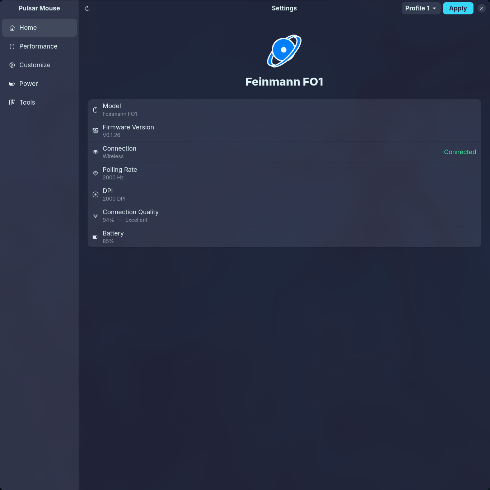
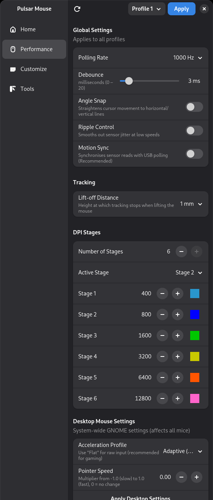
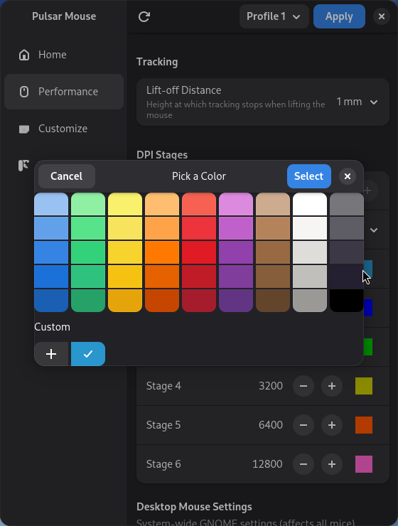
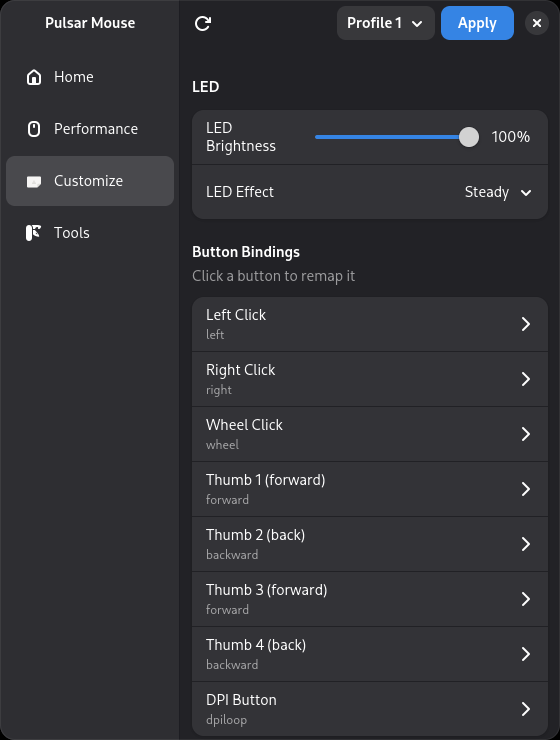
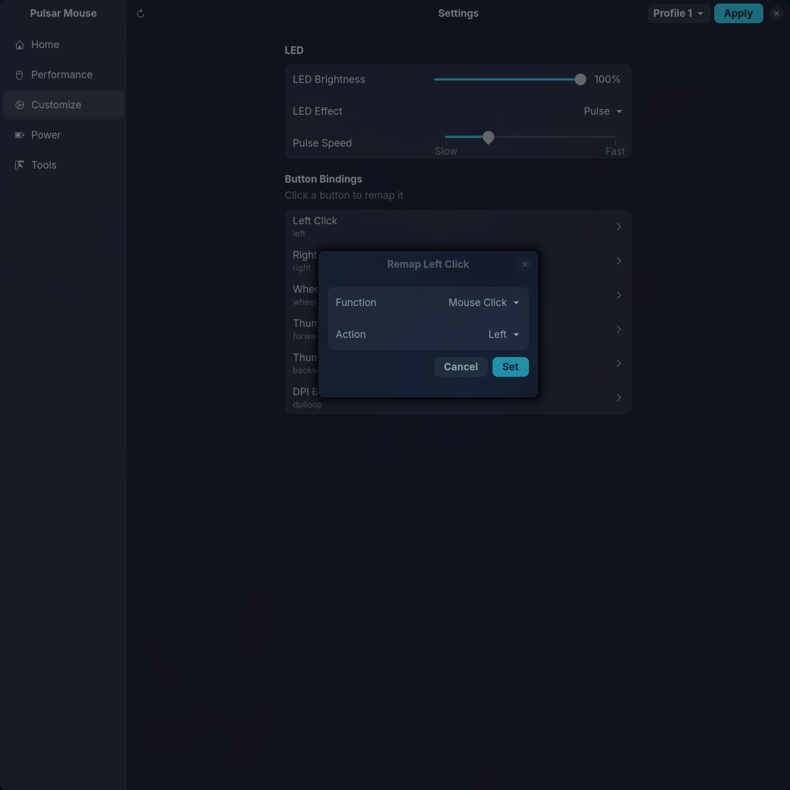
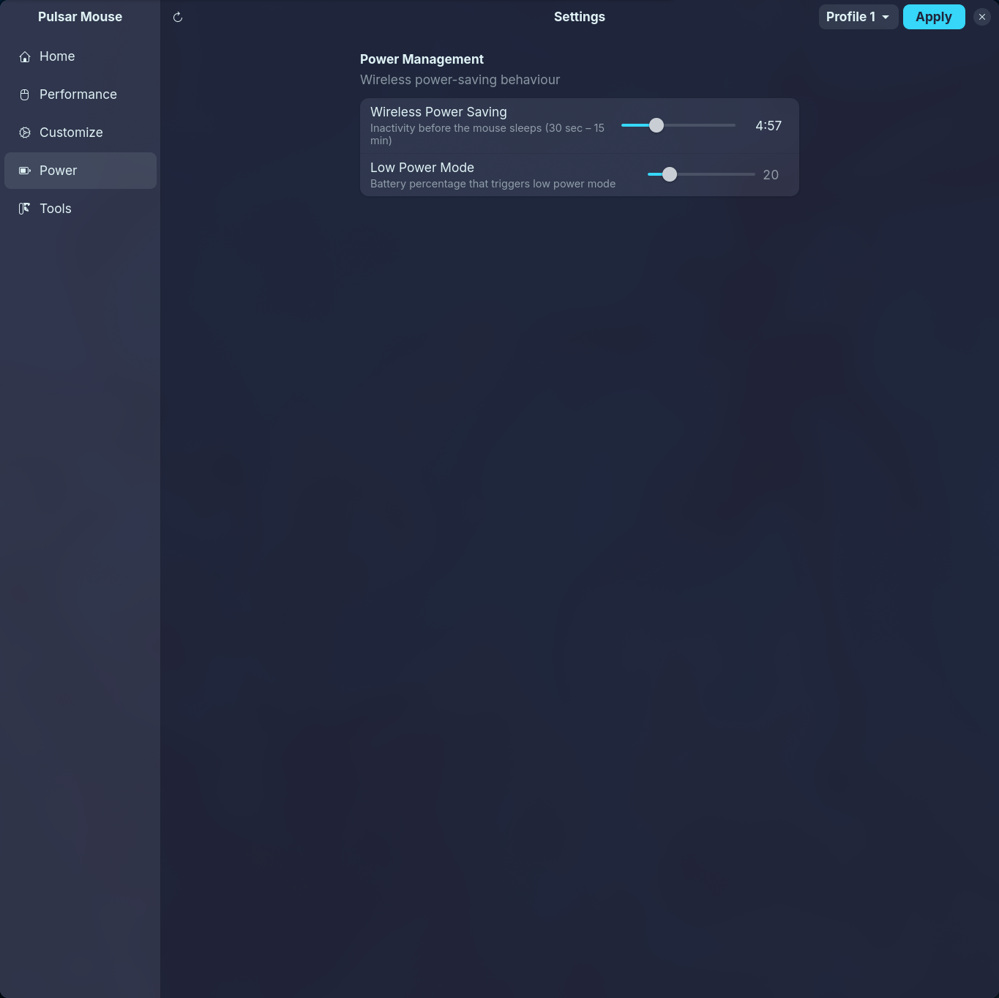
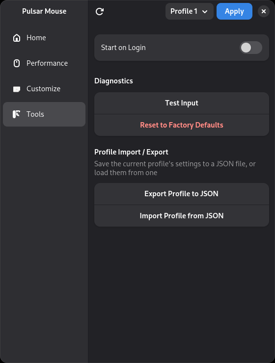
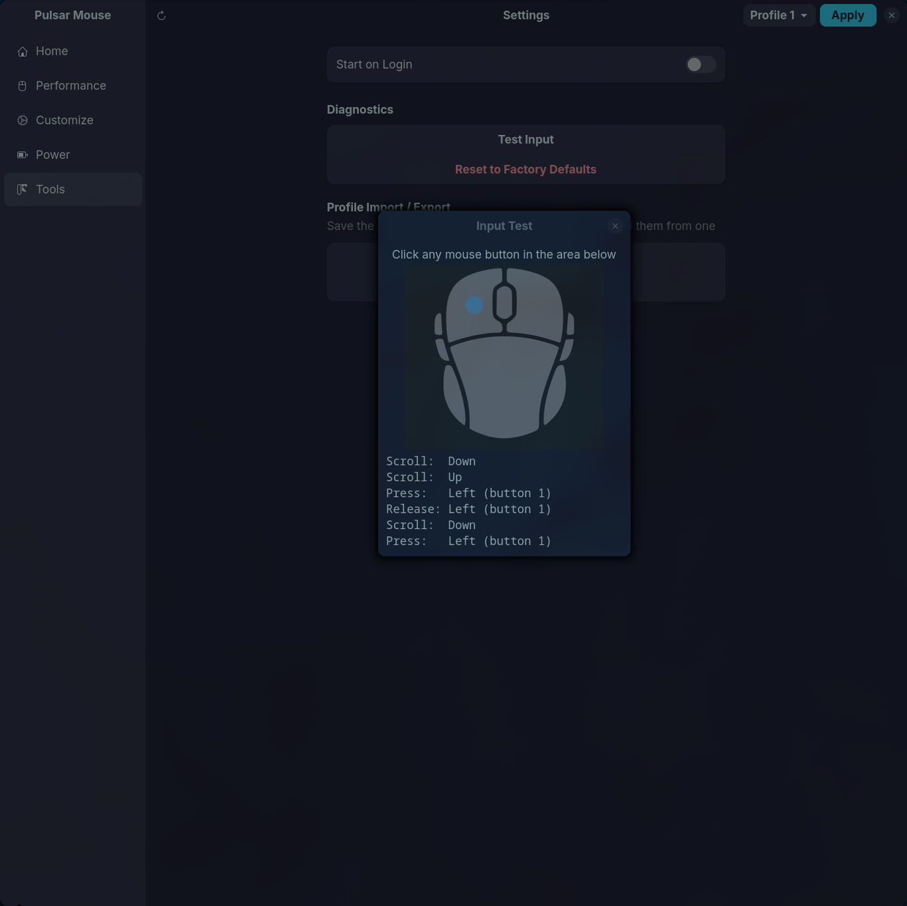
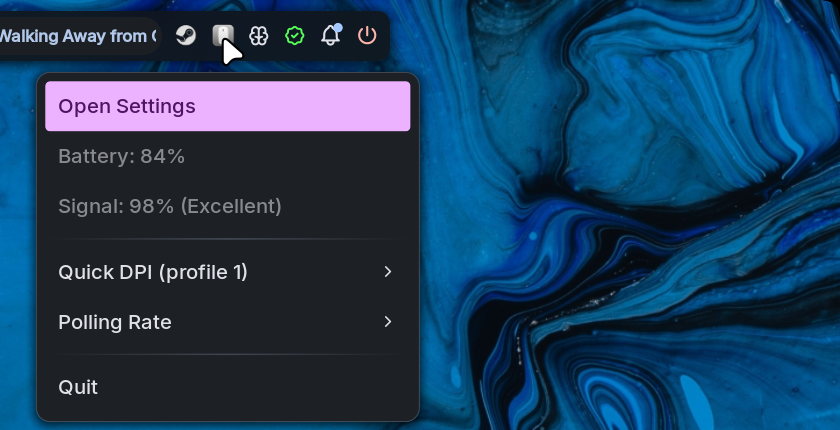

<p align="center">
  
</p>

# pulsar-mouse-linux

Linux configuration tool for **Pulsar gaming mice**.

Plugin architecture — each mouse model has its own protocol driver.
Currently supports the **Pulsar Xlite Wired**, **Pulsar X2 Wired**, **Pulsar X2H Wired Medium**, **Pulsar X2A Medium Wired**, **Pulsar Xlite v4**, **Pulsar Feinmann 8K / FO1**, and **Pulsar X2A Wireless / X2 V2 Mini** — see [Supported Mice](#supported-mice) below.

Reverse-engineered from USB HID captures of Pulsar Fusion on Windows 11.
Wireless (Nordic) protocol based on [python-pulsar-mouse-tool](https://github.com/andrewrabert/python-pulsar-mouse-tool) by andrewrabert.


## Screenshots

| Home | Performance |
|:---:|:---:|
|  |  |

| Colour Picker | Customize |
|:---:|:---:|
|  |  |

| Button Remap | Power |
|:---:|:---:|
|  |  |

| Tools | Input Test |
|:---:|:---:|
|  |  |

| System Tray |
|:---:|
|  |

## Supported Mice

| Model | Driver | VID:PID | Status |
|---|---|---|---|
| Pulsar Xlite Wired | `xlite_wired` | `3710:1401` | Supported (Sonix, 50 DPI step) |
| Pulsar X2 Wired | `x2_wired` | `3710:1402` | Supported (Sonix) |
| Pulsar X2H Wired Medium | `x2h` | `3710:1403` | Fully supported |
| Pulsar X2A Medium Wired | `x2a` | `3710:1404` | Fully supported |
| Pulsar Xlite v4 | `xlite_v4` | `3710:3401` | Untested (same Sonix protocol) |
| Pulsar Feinmann 8K / FO1 | `feinmann8k` | `3710:5404` | Fully supported (wireless dongle, 8K Hz polling, 6 onboard profiles) |
| Pulsar X2A Wireless / X2 V2 Mini | `nordic` | `3554:f507` `3554:f508` | Supported (Nordic chipset, battery status) |

Want to add support for your mouse? See [Adding a new driver](#adding-a-new-driver) below.

## Requirements

**Debian / Ubuntu:**
```bash
sudo apt install python3-usb python3-gi gir1.2-gtk-4.0 gir1.2-adw-1 gir1.2-dbusmenu-glib-0.4
```

**Fedora:**
```bash
sudo dnf install python3-pyusb python3-gobject gtk4 libadwaita libdbusmenu
```

**Arch Linux:**
```bash
sudo pacman -S python-pyusb python-gobject gtk4 libadwaita libdbusmenu-glib
```

On GNOME you also need the AppIndicator shell extension for the tray icon to appear:
```bash
sudo apt install gnome-shell-extension-appindicator   # Debian/Ubuntu
# then enable it (Ubuntu):
gnome-extensions enable ubuntu-appindicators@ubuntu.com
# or on other distros:
gnome-extensions enable appindicatorsupport@rgcjonas.gmail.com
```
Then restart GNOME Shell (log out/in, or Alt+F2 → r → Enter on X11).

KDE Plasma & Hyprland support the system tray natively — no extra extensions needed.

## Installation

### Option 1: Package (.deb / .rpm)

Download from the [latest release](https://github.com/packerlschupfer/pulsar-mouse-linux/releases):

```bash
# Debian / Ubuntu
sudo dpkg -i pulsar-mouse-linux_*.deb

# Fedora
sudo dnf install ./pulsar-mouse-linux-*.noarch.rpm
```

### Option 2: AppImage (any distro, no install)

```bash
chmod +x pulsar-mouse-linux-*-x86_64.AppImage
./pulsar-mouse-linux-*-x86_64.AppImage          # GUI
./pulsar-mouse-linux-*-x86_64.AppImage --cli     # CLI
```

Bundles Python + pyusb. The GUI still needs system GTK4/libadwaita installed.
udev rules must be installed separately (see below).

### Option 3: Tarball (any distro)

```bash
tar xzf pulsar-mouse-linux-*.tar.gz
cd pulsar-mouse-linux-*
sudo ./install.sh
```

### Option 4: From git

```bash
git clone https://github.com/packerlschupfer/pulsar-mouse-linux
cd pulsar-mouse-linux
pip install --user -e .
```

### Option 5: Nix / NixOS

Ships a flake. Run it directly without installing:

```bash
nix run github:packerlschupfer/pulsar-mouse-linux          # GUI
nix run github:packerlschupfer/pulsar-mouse-linux#cli      # CLI
```

Or add it as a flake input:

```nix
inputs.pulsar-mouse-linux = {
  url = "github:packerlschupfer/pulsar-mouse-linux";
  inputs.nixpkgs.follows = "nixpkgs";
};
```

then either reference `inputs.pulsar-mouse-linux.packages.${system}.default` directly, or pull in `inputs.pulsar-mouse-linux.overlays.default` and use `pkgs.pulsar-mouse-linux` as normal. The package ships the udev rules under `lib/udev/rules.d/` — on NixOS, add it to `services.udev.packages = [ pkgs.pulsar-mouse-linux ];` and they'll be picked up automatically, no manual `udevadm` steps needed.

Also published as a rolling release on [FlakeHub](https://flakehub.com/flake/packerlschupfer/pulsar-mouse-linux) — use this instead of the `github:` reference if you'd rather resolve through FlakeHub's CDN/registry than GitHub directly:

```bash
nix run "https://flakehub.com/f/packerlschupfer/pulsar-mouse-linux/*.tar.gz"
```

```nix
inputs.pulsar-mouse-linux = {
  url = "https://flakehub.com/f/packerlschupfer/pulsar-mouse-linux/*.tar.gz";
  inputs.nixpkgs.follows = "nixpkgs";
};
```

### udev rules (run without sudo)

Packages install udev rules automatically. For git installs:

```bash
sudo cp udev/50-pulsar-mouse.rules /etc/udev/rules.d/
sudo udevadm control --reload-rules && sudo udevadm trigger
```

Access is granted via `TAG+="uaccess"` (systemd-logind ACL) — no group membership or re-login needed; just re-plug the mouse.

## GUI + System Tray

```bash
pulsar-mouse-gui    # if installed via .deb
# or: PYTHONPATH=src python3 -m pulsar_mouse.gui
```

GTK4 + libadwaita settings window with integrated system tray:
- Auto-detects connected Pulsar mouse and adapts UI to its capabilities
- Reads all settings from the mouse on startup, writes on **Apply**
- System tray via D-Bus StatusNotifierItem (no GTK3 conflict)
- Tray shows DPI/polling rate on change, quick DPI presets, polling rate radio buttons
- **X** hides the window (tray stays alive), **Quit** from tray menu exits
- "Start on Login" toggle in the tray menu for autostart
- Input test dialog with mouse diagram and event log
- Battery level and charging state (on supported wireless mice) shown on the Home page and as a tray icon overlay - polled every 60s, so plugging/unplugging the charging cable can take up to a minute to be reflected. This is deliberate, not a bug: polling more often would mean more frequent USB interface claims and a higher chance of interfering with the mouse's own wireless power-saving sleep.
- Desktop mouse settings (GNOME acceleration profile, pointer speed)

## CLI usage

```
# Show all settings (auto-detects mouse)
sudo pulsar-mouse

# Show one profile
sudo pulsar-mouse --profile 1

# Polling rate (global)
sudo pulsar-mouse --poll 1000      # 125 / 250 / 500 / 1000

# Debounce (global, ms)
sudo pulsar-mouse --debounce 3

# Switches (global: on/off)
sudo pulsar-mouse --angle-snap off
sudo pulsar-mouse --ripple off
sudo pulsar-mouse --motion-sync off

# DPI stages for profile 1 (up to 6 stages)
sudo pulsar-mouse --profile 1 --dpi 400,800,1600,3200
sudo pulsar-mouse --profile 1 --dpi 400,800,1600,3200 --active-stage 2

# Lift-off distance (per-profile)
sudo pulsar-mouse --profile 1 --lod 1    # 1 mm or 2 mm

# LED brightness and effect (per-profile)
sudo pulsar-mouse --profile 1 --brightness 200
sudo pulsar-mouse --profile 1 --led steady
sudo pulsar-mouse --profile 1 --led breathe --breathe-speed 50

# Per-stage LED colour (per-profile, RGB 0-255)
sudo pulsar-mouse --profile 1 --stage-color 1 255 0 0    # stage 1 = red

# Button remapping (per-profile)
sudo pulsar-mouse --profile 1 --button thumb1 dpi+
sudo pulsar-mouse --profile 1 --button thumb1 ctrl+c

# Profile backup/restore (per-profile)
sudo pulsar-mouse --profile 1 --export profile1.json
sudo pulsar-mouse --profile 2 --import profile1.json

# Battery/charging status as JSON, for scripts (wireless mice only)
pulsar-mouse --battery-json
```

## Noctalia Plugin

There's a [Noctalia](https://github.com/noctalia-dev/noctalia) shell plugin backed by this CLI — a bar widget, a desktop/lock-screen widget showing battery percentage and charging status, and a quick-controls panel (DPI, polling rate, debounce, angle snap/ripple/motion sync, lift-off distance, LED, and on wireless mice power management, plus a profile switcher on multi-profile mice). Works with just the `pulsar-mouse` CLI installed; more efficient if `pulsar-mouse-gui` is also running, since the widgets read its periodic reading instead of polling the mouse themselves.

It used to live in this repo at `pulsar-mouse/`, but moved to its own repo, [pulsar-mouse-noctalia](https://github.com/harveywuk/pulsar-mouse-noctalia), since [noctalia-dev/community-plugins](https://github.com/noctalia-dev/community-plugins) (submitted [here](https://github.com/noctalia-dev/community-plugins/pull/318)) expects each plugin as its own directory with no unrelated code alongside it. See that repo's [README](https://github.com/harveywuk/pulsar-mouse-noctalia/blob/main/pulsar-mouse/README.md) for settings and details.

Once the submission is merged, installing it will just be a search away in Noctalia's plugin store. Until then (or for local development), add it as a path source:

```bash
noctalia msg plugins source add pulsar-mouse path ~/dev/pulsar-mouse-noctalia   # or wherever you cloned that repo
noctalia msg plugins enable harveywuk/pulsar-mouse
```

Then add the `bar` or `battery` widget from Noctalia's widget editor.

## Adding a new driver

Each Pulsar mouse model uses a different USB protocol. To add support for a new model:

1. Create `src/pulsar_mouse/drivers/yourmodel.py`
2. Subclass `PulsarDevice` from `pulsar_mouse.base`
3. Define `capabilities` as a class variable (a `DeviceCapabilities` dataclass)
4. Implement the protocol methods (`open`, `close`, `get/set_polling_rate`, `get/set_dpi_stages`, etc.)
5. Add an entry point in `pyproject.toml`:
   ```toml
   [project.entry-points."pulsar_mouse.drivers"]
   yourmodel = "pulsar_mouse.drivers.yourmodel:YourClass"
   ```
6. Add udev rules for the new VID/PID in `udev/50-pulsar-mouse.rules`

The CLI and GUI will automatically detect the new driver and adapt their UI.

External driver packages can also register via entry points without modifying this repo.

## OS Tweaks for Gaming

The GUI has a "Desktop Mouse Settings" section on the Performance page that
auto-detects whether  GNOME, Hyprland, or KDE Plasma is running and shows
the matching controls.

### Disable mouse acceleration (recommended for FPS gaming)

```bash
# GNOME (Wayland or X11)
gsettings set org.gnome.desktop.peripherals.mouse accel-profile 'flat'
gsettings set org.gnome.desktop.peripherals.mouse speed 0   # 0 = neutral

# Hyprland - live immediately, but runtime-only; add the input {} block
# below to your hyprland.conf (or a sourced file) to persist it
hyprctl keyword input:accel_profile flat
hyprctl keyword input:sensitivity 0.0
# input {
#     sensitivity = 0.0
#     accel_profile = flat
# }

# KDE Plasma - written to kcminputrc, requires kwriteconfig5/6
kwriteconfig6 --file kcminputrc --group Mouse --key XLbInptAccelProfileFlat true
kwriteconfig6 --file kcminputrc --group Mouse --key XLbInptPointerAcceleration 0.0
```

### Kernel boot options (advanced)

For lowest possible input latency, add to `/etc/default/grub` in
`GRUB_CMDLINE_LINUX_DEFAULT`:

```
usbhid.mousepoll=1    # 1ms USB polling (default is 10ms for non-gaming mice)
```

Then run `sudo update-grub && reboot`.

> **Note:** The mouse already reports `bInterval=1` so the kernel should
> honour 1ms polling by default with most USB controllers. This option is
> only needed if you suspect the kernel is overriding the interval.

## Protocol notes (X2A)

| Setting | Scope | cat | reg (write/read) | sub |
|---|---|---|---|---|
| Polling rate | global | 0x01 | 0x09 / 0x89 | 0x02 |
| Debounce | global | 0x04 | 0x03 / 0x83 | 0x03 |
| Angle snap | global | 0x07 | 0x04 / 0x84 | 0x02 |
| Ripple control | global | 0x07 | 0x03 / 0x83 | 0x02 |
| Motion sync | global | 0x07 | 0x05 / 0x85 | 0x02 |
| LOD | per-profile | 0x07 | 0x02 / 0x82 | 0x03 |
| DPI stages (bulk) | per-profile | 0x05 | 0x04 / 0x84 | 0x21 / 0x15 |
| DPI active stage | per-profile | 0x05 | 0x01 / 0x81 | 0x02 |
| Stage LED colour | per-profile | 0x05 | 0x05 / 0x85 | 0x05 |
| Brightness | per-profile | 0x03 | 0x03 / 0x83 | 0x03 |
| LED effect | per-profile | 0x03 | 0x04 / 0x84 | 0x0F |

Packet: 64 bytes, Interface 3, HID Feature report (wValue=0x0300).
Checksum: bytes[62:64] = LE uint16(sum(bytes[0:62])).

## Credits

- [@packerlschupfer](https://github.com/packerlschupfer) — Original creator and maintainer of pulsar-mouse-linux
- [@harveywuk](https://github.com/harveywuk) — Feinmann 8K/FO1 driver, multi-profile support, button remapping, desktop pointer-settings integration, Nix flake, GUI redesign, protocol reliability fixes (stale-reply guard, LED read-modify-write, RF settle timing)
- [@Scout339](https://github.com/Scout339) — Logo design, wireless mouse testing
- [andrewrabert](https://github.com/andrewrabert) — [python-pulsar-mouse-tool](https://github.com/andrewrabert/python-pulsar-mouse-tool), reference implementation for the Nordic wireless protocol

## Related Projects

- [python-pulsar-mouse-tool](https://github.com/andrewrabert/python-pulsar-mouse-tool) — Linux tool for the Pulsar X2 V2 Mini (wireless, battery support)
